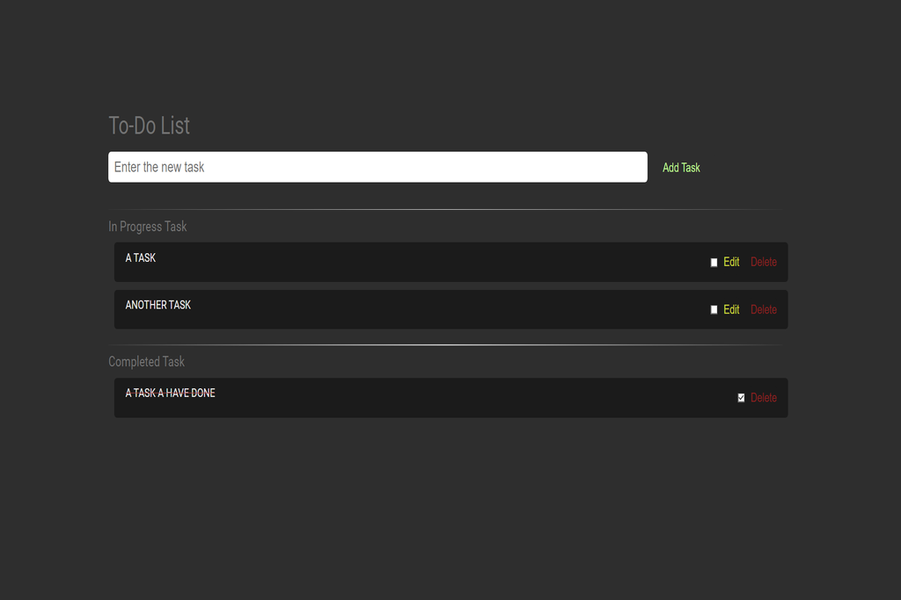

# Todo List

Welcome to the React Todo List project, where the information is stored in the browser's localstorage.

## Installation

To install this project, follow these simple steps:

1. Clone the repository to your local machine using `git clone https://github.com/yourusername/react-todo-list.git`
2. Navigate to the project directory with `cd react-todo-list`
3. Install the necessary dependencies with `npm install` or `yarn install`
4. Start the project with `npm start` or `yarn start`

Once done, your browser will automatically open the application on its default port (usually http://localhost:3000/).

## Functionality

The application is very easy to use:

1. Add a task by clicking the "Add task" button and typing the task text in the input field
2. Mark a task as complete by clicking the corresponding checkbox
3. Delete a task by clicking the "Delete" button

All tasks are automatically saved to the browser's localstorage, so they won't be lost even if you close the tab or the browser.

## Technologies used

This project is built with the following technologies:

- [React](https://reactjs.org/): A JavaScript library for building user interfaces
- [localStorage API](https://developer.mozilla.org/en-US/docs/Web/API/Window/localStorage): A web API for storing data in the browser

## Screenshot

  

## Test Project

> https://lucasbutto.github.io/todo-list/
